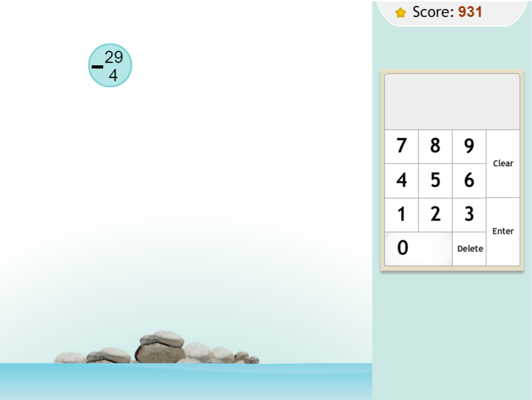
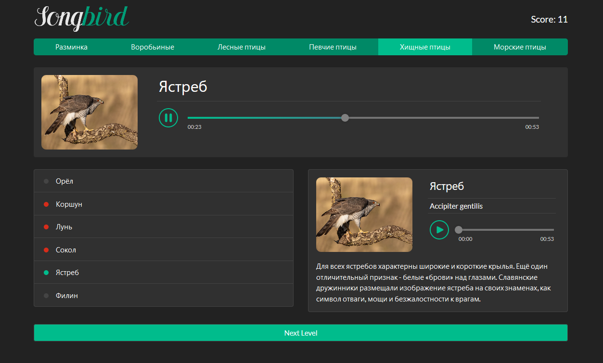

Задание1: Создание виджета опроса на JavaScript

Первое задание сразу охватывает две больших темы: DOM и события в DOM.
Вам нужно написать скрипт, который добавляет опросы как в ВК (зайдите к себе на стену и попробуйте добавить опрос):

весь виджет (наша форма с полями) должен быть в div с уникальным
идентификатором или классом — для избежания конфликта с чужим кодом
CSS стили должны сопровождаться уникальными идентификатором или классом из
предыдущего пункта
должна быть максимум одна глобальная переменная
Решение должны быть в виду ссылки на codepen
Решение должно быть оформлено как блока с уникальным идентификатором — никаких полных HTML страниц
все HTML содержимое виджета должно быть в этом блоке
никаких <script > в codepen не нужно
все CSS стили должны быть написаны относительно уникального id/class
В «Добавить опрос», при нажатии на нее должна появляться форма с радиокнопками и вариантами из Ваших полей, а также
кнопка «ответить»
Дизайн строгий минималистический (не нужно добавлять изображения, лишнее CSS-оформление)

Задание 2: Cоздать плагин автотегов на JavaScript

Создать плагин автотегов, например как тут (но без jQuery): http://www.jqueryscript.net/demo/Colorfy-Tags-Mentions-In-An-Editable-Content-jQuery-autotag/

реализовать скрипт, который выполняет ту же работу
нельзя использовать сторонние библиотеки
можно писать текст в одном textarea, а результат форматировать в другом HTML элементе
виджет должен размещаться в <div class=»specEditor»></div>
все стили должны указываться относительно указанного класса

Задание 3: Создать lightbox
Создать лайтбокс с возможностью перехода от одного изображения к другому. По аналогии с http://lokeshdhakar.com/projects/lightbox2/

плагин должен работать корректно при любом соотношении сторон экрана
маленьких и большие изображения должны отличаться исходным размером и весом (нельзя один файл одновременно использовать для thumbnail и увеличенного изображения)

Задание 4: Добавление строки в таблицу
Создать форму и таблицу. Написать скрипт, добавляющий содержимое формы в таблицу в виде строки

Форма добавления должна размещаться над или под таблицей
Дизайн строгий минималистический (не нужно добавлять изображения, лишнее CSS-оформление)

Задание 5: Фильтрация строк таблицы
Создать форму и таблицу. У формы должно быть столько же полей, сколько колонок у таблицы. Фильтровать строки таблицы по данным, вводимым в форму.

Сортировка должна вестись одновременно по нескольким полям: при вводе в два поля, строка должна содержать результат соответствующий двум условиям


Задание 6: Удаление строки таблицы
Добавить в таблицу возможность удаления строки по нажатию. Примечание: после реализации добавить анимацию (плавное растворение перед удалением)

Задание 7: Построение дерева чекбоксов
Реализовать дерево чекбоксов, см пример

Задание 8: Создание подсказки при поиске
Создать скрипт, который при вводе в input[type=text] выходит результат поиска по массиву с текстовыми элементами. Примечание: визуально это должно выглядеть, как делает Яндекс.

При каждом нажатии в input, из заранее заданного массива нужно показывать ограниченный набор слов, совпадающих с вводом
При клике — выбранная подсказка должна устанавливаться в input и более ничего

Задание 9: Зависимые списки
Реализовать зависимые списки. Примечание: https://youtu.be/ojx67tQmDF8

Задание 10: ToDo лист
Создать скрипт учитывающий список дел (todo лист). Дела можно добавлять, удалять, помечать выполненными или снимать отметку о выполнении.

Задание 11: Сортировка HTML списка
Сортировка html списка по алфавиту. Например есть список

```html
<ul id="sort">
  <li>Lorem.</li>
  <li>Quisquam!</li>
  <li>Eveniet?</li>
  <li>Odio.</li>
  <li>Voluptatibus.</li>
</ul>
```
Нужно применить плагин так, чтобы пункты списка были отсортированы по алфавиту (или в обратном порядке).

Задание 12: Модальное окно
Реализовать модальное окно - чтобы закрывалось по клику вне модалки

Задание 13: Корзина интернет-магазина
Попробовать реализовать корзину как в интернет-магазинах. Кликаешь на элемент он добавляется в корзину и вместо кнопки добавить появляется кнопка удалить из корзины (пример приблизительный тут: https://online-store-rs.netlify.app/

Задание 14: Тосты
Сделать выезжающие тосты (нотификашки) - https://codepen.io/wontem/full/QwwKqy/

Задание 15: Выезжающее бургер меню
Реализовать выезжающее меню (как на мобилках обычно показывается бургер ты по нему кликаешь и выезжает менюшка основная)

Задание 16: Интернет-магазин
https://github.com/rolling-scopes-school/tasks/tree/master/tasks/online-store

Задание 17: Калькулятор
https://github.com/rolling-scopes-school/tasks/blob/master/tasks/ready-projects/calculator.md

Задание 18: Приложение для медитации
https://github.com/rolling-scopes-school/tasks/blob/master/tasks/ready-projects/meditation-app.md

Задание 19: Моментум
https://github.com/rolling-scopes-school/tasks/blob/master/tasks/ready-projects/momentum.md

Задание 20: Виртуальная клавиатура
https://github.com/rolling-scopes-school/tasks/blob/master/tasks/ready-projects/virtual-keyboard.md

Задание 21: Реализовать каруceль
Карусель чтобы двигала элементы в лево или право (по кнопкам). Также была возможнеость свайпать на мобильных устройствах. Карусель отличается от слайдера тем, что у слайдера всегда отображается 1 элемент, а карусели их можнео быть несколько

http://kenwheeler.github.io/slick/

Задача 22: Обратный отсчет времени
таймер

Задача 23: Приложение погоды
https://github.com/rolling-scopes-school/tasks/blob/master/tasks/stage-0/fancy-weather.md

Задача 24: Фотофильтр (CSS + JS)
CSS Variables and JS

Фоторедактор, позволяющий редактировать изображение, применяя к нему различные свойства и фильтры. Третий таск челленджа JavaScript30
Чему вы научитесь: работать с изображениями, css-фильтрами, css-переменными
Видео: https://youtu.be/AHLNzv13c2I (13:13)
Дополнительный материал: Изучите CSS-переменные за 5 минут
Код: https://github.com/wesbos/JavaScript30/tree/master/03%20-%20CSS%20Variables (9 lines js-code)
Demo: https://js3003.github.io/


Задача 25: Flex Panel Gallery

Слайдер изображений на JavaScript. Пятый таск челленджа JavaScript30
Чему вы научитесь: создадите слайдер изображений на JavaScript, закрепите знания про флексбоксы
Видео: https://youtu.be/9eif30i26jg (13:09)
Код: https://github.com/wesbos/JavaScript30/tree/master/05%20-%20Flex%20Panel%20Gallery (15 lines js-code)
Demo: https://js3005.github.io/


Задача 25: Fun with HTML5 Canvas
Канвас, на котором можно рисовать линии, толщина и цвет которых изменяются в процессе рисования. Восьмой таск челленджа JavaScript30. Добавьте приложению палитру, в которой можно будет выбрать цвет и толщину линии.
Чему вы научитесь: создавать приложения с использованием canvas
Видео: https://youtu.be/8ZGAzJ0drl0 (18:01)
Код: https://github.com/wesbos/JavaScript30/tree/master/08%20-%20Fun%20with%20HTML5%20Canvas (54 lines js-code)
Demo: https://canvas30.github.io/

Задача 26: raindrops
Вам необходимо создать приложение - тренажёр по математике, позволяющий закрепить навыки арифметических действий: сложения, вычитания, умножения и деления.

Условие задачи написано в капле дождя, которая падает с определенной скоростью. Ответ вводится на панели с цифрами. Необходимо успеть ввести ответ до того, как капля упадёт.


Видеообзор игры - https://www.youtube.com/watch?v=YDzeM8R4d24
Demo Для просмотра игры нужно разрешить flash player - https://www.to14.com/game.php?id=4d486a66950d8#
В оформление игры можно вносить свои изменения с целью его улучшения

Задача 26: Custom Video Player
Создание кастомного видеоплеера с возможностью добавления пользовательских настроек. Одиннадцатый таск челленджа JavaScript30.
Чему вы научитесь: усовершенствуете навыки работы с видео
Видео: https://youtu.be/yx-HYerClEA (24:33)
Код: https://github.com/wesbos/JavaScript30/tree/master/11%20-%20Custom%20Video%20Player (55 lines js-code)
Demo: https://js3011.github.io/

Задача 27: Video Speed Controller
Регулятор скорости воспроизведения видео. Перемещая ползунок, который находится справа от плеера, можно ускорять или замедлять скорость воспроизведение видео. Двадцать восьмой таск челленджа JavaScript30
Чему вы научитесь: усовершенствуете навыки работы с видео
Видео: https://youtu.be/8gYN_EDMg_M (9:25)
Код: https://github.com/wesbos/JavaScript30/tree/master/28%20-%20Video%20Speed%20Controller (16 lines js-code)
Demo: https://js3028.github.io/

Задача 28: Whack-A-Mole
Игра на скорость реакции, в которой нужно кликать по целям и зарабатывать баллы. Тридцатый таск челленджа JavaScript30. Дополните игру постепенно усложняющимися уровнями, сохранением результата текущей игры в local storage.
Чему вы научитесь: создадите игру на JavaScript
Видео: https://youtu.be/toNFfAaWghU (14:34)
Код: https://github.com/wesbos/JavaScript30/tree/master/30%20-%20Whack%20A%20Mole (50 lines js-code)
Demo: https://js3030.github.io/

Задача 29: Chat on socket.io
Приложение-чат для отправки / получения сообщений в режиме реального времени в котором есть клиентская и серверная часть кода
Чему вы научитесь: работать с node.js и socket.io
Туториал: https://medium.com/freecodecamp-russia-русскоязычный/создание-простого-приложения-для-чата-с-помощью-node-js-и-socket-io-eb7498391611
Код: https://github.com/YKalashnikov/Chat-app-with-node.js-and-socket.io (72+31 lines js-code)


Задача 30: Songbird - приложение-викторина для распознавания птиц по их голосам.
https://github.com/rolling-scopes-school/tasks/blob/master/tasks/songbird/songbird-2022q3.md

