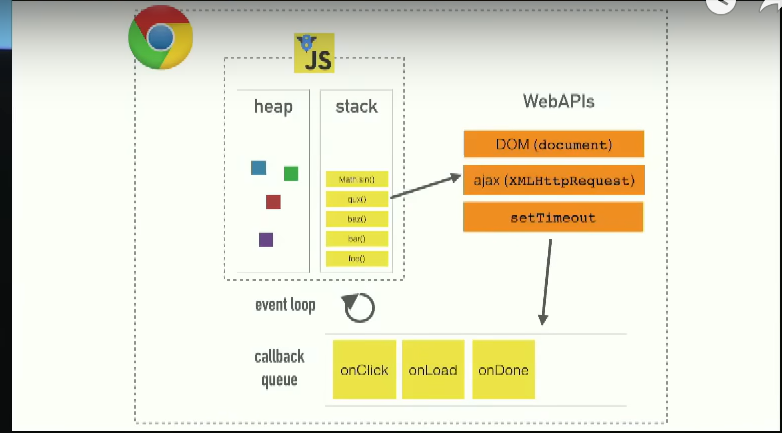

Материалы:
1. http://rolling-scopes.github.io/slides/school/event-loop/#/
2. https://developer.mozilla.org/ru/docs/Web/JavaScript/Reference/Global_Objects/Promise
3. http://latentflip.com/loupe/?code=JC5vbignYnV0dG9uJywgJ2NsaWNrJywgZnVuY3Rpb24gb25DbGljaygpIHsKICAgIHNldFRpbWVvdXQoZnVuY3Rpb24gdGltZXIoKSB7CiAgICAgICAgY29uc29sZS5sb2coJ1lvdSBjbGlja2VkIHRoZSBidXR0b24hJyk7ICAgIAogICAgfSwgMjAwMCk7Cn0pOwoKY29uc29sZS5sb2coIkhpISIpOwoKc2V0VGltZW91dChmdW5jdGlvbiB0aW1lb3V0KCkgewogICAgY29uc29sZS5sb2coIkNsaWNrIHRoZSBidXR0b24hIik7Cn0sIDUwMDApOwoKY29uc29sZS5sb2coIldlbGNvbWUgdG8gbG91cGUuIik7!!!PGJ1dHRvbj5DbGljayBtZSE8L2J1dHRvbj4%3D
4. https://www.youtube.com/watch?v=cCOL7MC4Pl0&t=1393s&ab_channel=JSConf
5. https://www.youtube.com/watch?v=8aGhZQkoFbQ&ab_channel=JSConf


# Сallstask
  
# Зачем асинхронные функции
 - Блокирующий JS
# setTimeout || setInterval


setTimeout - вызывается единоразово с задержкой, тоже нужно очищать
setInterval - вызывается циклом с задержкой которую мы поставим. Нужно его очищать через clearInveral
Оба относят к макротаскам

```javascript
let timerID = setTimeout(function delay() {
  alert('after 5s')
}, 5000);
clearTimeout(timerID);

setTimeout(function animation() {
    console.log('some animation')
}, 1000 / 60)
let intervalID = setInterval(function delay() {
    alert('every 5s')
}, 5000);
clearInterval(intervalID);
```


# Promise

Объект Promise используется для отложенных и асинхронных вычислений. - Промисы это микротаски

```javascript
const promise1 = new Promise((resolve, reject) => {
  setTimeout(() => {
    resolve('foo');
  }, 300);
});

promise1.then((value) => {
  console.log(value);
  // Expected output: "foo"
}).catch((e) => {
    console.log(e)
});

console.log(promise1);
```

```javascript
Promise.all([]) - // Ожидает исполнения всех промисов или отклонения любого из них.
Promise.race([]) - // Ожидает исполнения или отклонения любого из полученных промисов.
Promise.reject(reason) - // Возвращает промис, отклонённый из-за reason
Promise.resolve(value) - // Возвращает промис, исполненный с результатом value.
```

# WebAPIs



# CallBackQueue

# Как на самом деле работает Event Loop


RAF - Request animation frame


# Style -
это комбинирование DOM и CSSOM в дерево рендеринга. Конструирование этого дерева начинается с прохода всего DOM-дерева от корня, с выявлением каждого видимого узла.
# Layout -
- это запуск компоновки (layout) элементов дерева рендера. На этом шаге вычисляется геометрия каждого узла, то есть ширина, высота, положение элементов. Reflow (перекомпоновка) - это любой последующий процесс определения размеров и позиции для любой из частей целого документа.
- height, weight, offsetTop, offsetLeft, offsetHeight, offsetWidtn, scroll and e.t.c
# Paint -
- это отрисовка каждого отдельного узла на экране. Момент, когда это происходит впервые, называется first meaningful paint (первая значащая отрисовка). Во время фазы отрисовки или растеризации, браузер конвертирует каждый контейнер box в настоящие пиксели на экране (напомним, что данные контейнеров формируются на этапе layout). Отрисовка подразумевает рисование каждой визуальной частицы элемента на экране (текст, цвета, границы, тени) и рисование заменяемых элементов (картинки, кнопки). Браузер должен выполнять это быстро.
- background, color,  border-color и т.д.


```javascript
console.log('start');

setTimeout(() => console.log(2));

Promise.resolve().then(() => console.log(3));

Promise.resolve().then(() => setTimeout(() => console.log(4)));

Promise.resolve().then(() => console.log(5));

setTimeout(() => console.log(6));

console.log(7);

console.log('end')
```

```javascript
console.log('start');

const promise1 = Promise.resolve().then(() => {
    console.log('promise1');
    const timer2 = setTimeout(() => {
        console.log('timer2')
    }, 0)
});

const timer1 = setTimeout(() => {
    console.log('timer1')
    const promise2 = Promise.resolve().then(() => {
        console.log('promise2')
    })
}, 0)

console.log('end');
```
